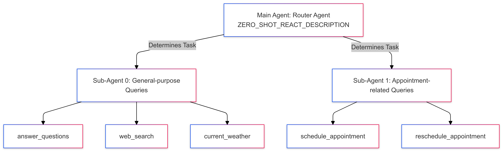
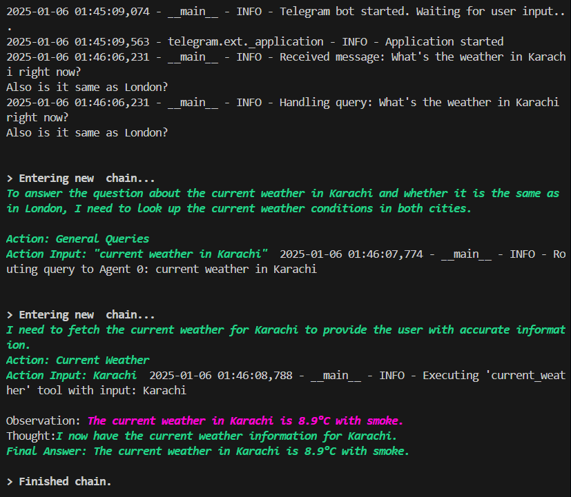
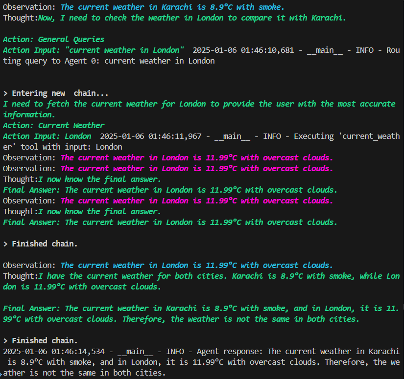

# 🤖 Telegram Bot with LangChain and OpenAI 🚀

This project is a Telegram bot powered by OpenAI's GPT-4o-mini model and LangChain. Designed as a boilerplate, the structure is highly customizable, with detailed comments and examples for easy future development. The bot is capable of handling general queries, performing web searches, and managing appointment scheduling and rescheduling. 

## 🌟 Features

- **💬 General Queries**: Answer user questions using the LLM.
- **🌐 Web Search**: Search the web for the latest information.
- **📅 Appointment Scheduling**: Schedule and reschedule appointments.
- **🌦️ Current Weather**: Provide real-time weather updates.


---

## 🛠️ Architecture Overview

### 🔍 Main Agent (Router Agent)
Analyzes user queries using ReAct to determine which sub-agent should handle the task.

### 🤖 Sub-Agents
- **Agent 0**: Handles general-purpose queries (e.g., `answer_questions`, `web_search`, `current_weather`).
- **Agent 1**: Manages appointment-related queries (e.g., `schedule_appointment`, `reschedule_appointment`).



---

## ⚙️ Setup Instructions

### 🔖 Creating a Telegram Bot

To create a Telegram bot:

1. Open Telegram and search for the **BotFather**.
2. Type `/newbot` and follow the prompts to create your bot.
3. Once done, you will receive an **API token** that will be used to authenticate your bot.

### Bot Setup Backend

1. **📥 Clone the repository**:
    ```sh
    git clone https://github.com/osamatech786/Telegram-Bot
    cd Telegram-Bot
    ```

2. **🐍 Create a virtual environment**:
    ```sh
    python -m venv venv
    source venv/bin/activate  # On Windows, use `venv\Scripts\activate`
    ```

3. **📦 Install dependencies**:
    ```sh
    pip install -r requirements.txt
    ```

4. **🔑 Set up environment variables**:
    Create a `.env` file in the project root and add your API keys:
    ```env
    OPENAI_API_KEY=your_openai_api_key
    SERPAPI_KEY=your_serpapi_key
    TELEGRAM_BOT_TOKEN=your_telegram_bot_token
    OPENWEATHER_API_KEY=your_openweather_key
    ```

---

## 🚀 Running the Bot

To start the bot, run:
```sh
python tg_bot_main.py
```

💡 **Usage**  
- **/start**: Send this command to receive a welcome message.  
- **/help**: Get instructions on how to use the bot.  
- **Ask questions**: Simply type your question or command, and the bot will respond accordingly.  

📊 **Logging**  
The bot uses Python's `logging` module to log important events and errors. Logs include timestamps and log levels, printed directly to the console.  

🔗 **References**  
- [LangChain Documentation](https://langchain.com/docs/)  
- [OpenAI API](https://beta.openai.com/docs/)  
- [Telegram Bot API](https://core.telegram.org/bots/api)  
- [SerpAPI](https://serpapi.com/)  
- [OpenWeather API](https://openweathermap.org/api)

---

## 📷 Output



---
Connect with me <a href="https://www.linkedin.com/in/osamatech786" target="_blank" rel="noreferrer">
---
📜 **License**  
This project is licensed under the MIT License.
